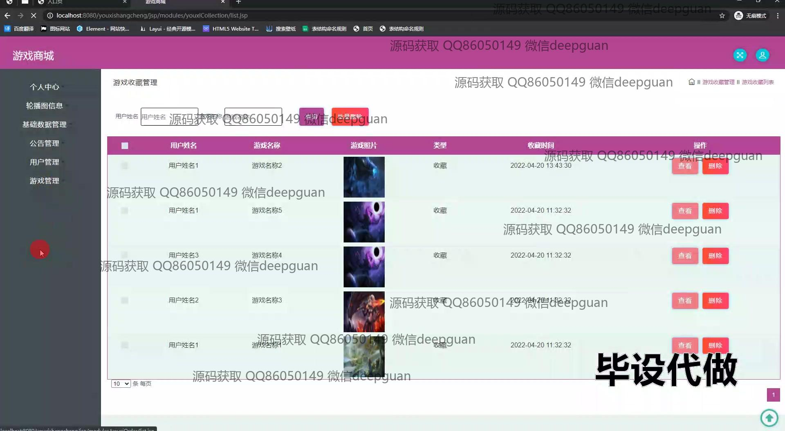

<h1 align="center">基于SSM的游戏商城的设计与实现+jsp</h1>

## 简介
基于Spring、Spring MVC、MyBatis开发的游戏商城系统，角色分为管理员、用户；支持游戏展示、购物车管理、公告管理、会员管理、订单管理、权限管理等功能。    --计算机毕业设计源码；毕设源码；java毕业设计源码

## 联系方式

<h3 align="center">获取完整代码与数据库文件 + 微信：deepguan QQ: 86050149 QQ群: 783742310</h3>

<h3 align="center">可帮忙远程部署 包运行成功！提供远程部署、修改代码、设计文档指导、代码讲解等服务！</h3>

## 功能介绍（完整见运行截图）
管理员：管理系统中的用户、会员和游戏等信息，支持查看、编辑和删除操作，能够管理公告、轮播图信息和基础数据，并进行订单管理，包括查询和评价订单。可通过后台编辑会员等级类型，调整会员折扣，方便履行管理职能，确保商城顺利运作。  
用户：在商城前端进行注册和登录，浏览和搜索游戏信息，根据需求查看游戏详情、下载链接和购买页面，能够加入购物车，进行购买结算。用户可以管理自己的个人信息、查看订单、管理收藏，以及根据游戏类型查看公告和政策展示。  
商城功能：提供游戏展示，支持通过游戏名称或编号进行搜索，游戏详情页展示开发商、支持语言、发布日期、购买次数、价格和评分，并能显示详细介绍和用户评价，方便用户通过信息选择合适的游戏进行购买。  
购物车和结算：购物车页面显示已选择游戏的名称、价格和数量，支持删除不需游戏，并能查看购物车总价，提供结算按钮实现订单生成。通过购物车管理及结算功能，实现购买操作全流程，提升用户体验。

## 运行截图

本代码来源于网络,仅供学习参考使用!

